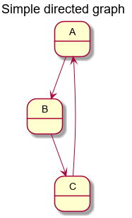
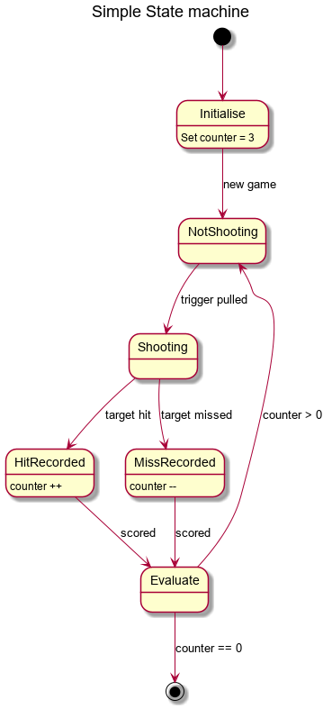
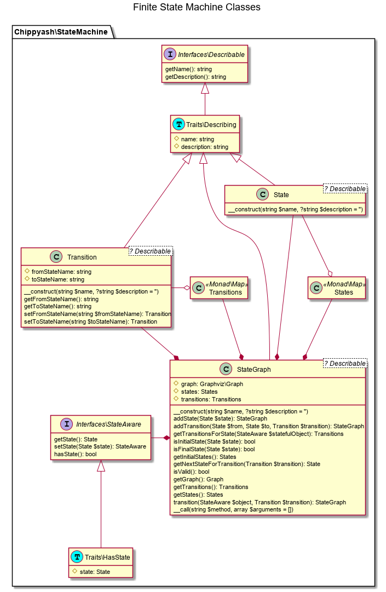

# Finite State Machine
## chippyash/finite-state-machine

## What

Provides an Event aware Finite State Machine (FSM) implementation 

## Why

FSMs allow us to separate out the logic of how objects change 
state from the object themselves.  It also means that we can configure 
state in the DIC or some other external storage, and therefore change 
it easily to fine tune for particular circumstances without breaking 
the object itself.

FSMs are the perfect tool for implementing workflow solutions.

## How

Conceptually, a state machine is a form of [directed graph](https://en.wikipedia.org/wiki/Directed_graph)*[]: 
A number of nodes (states), connected by edges (transitions) that can only
go in one direction.  In graph theory, a directed graph doesn’t necessarily 
have a start and end point.



We can implement this theoretical graph using a [Finite State Machine](https://en.wikipedia.org/wiki/Finite-state_machine) (FSM).
Another term for this is ‘[Deterministic Finite Automaton](https://en.wikipedia.org/wiki/Deterministic_finite_automaton)’.  An FSM always 
has a start point or starting `state`, but may not have an end state, i.e. 
the state can be constantly in flux.  An object
`transitions` from one state to another depending on the transitions 
available to it and any conditions attached to the transition.
A transition is initiated by an `event`.


A thing or object that is being controlled by an FSM can only be in one 
state at a time.  This is very different from a Multiple State Machine or 
[Nondeterministic Finite Automaton](https://en.wikipedia.org/wiki/Nondeterministic_finite_automaton), 
which whilst they have their use in computing patterns, are not used for 
typical human oriented workflows (people being really bad at doing two 
things at the same time!). Note however that it is entirely possible for 
an object to be involved in two or more parallel activities, e.g. if an 
object has a state of ‘communicate’, then it is feasible that as parallel 
activities it can communicate via email and communicate via sms.  When 
both activities are complete it can be moved from the ‘communicate’ state 
to some other state.

I use the term ‘*object that is being controlled by an FSM*' in a precise 
sense. A common mistake when designing workflow systems is to tie the 
state change to the object in question.  This invariably leads to 
polluting the object itself with stuff about how to change state. That 
is wrong, and leads to convoluted code that has nothing to do with the 
object’s principle responsibility, e.g. representing an Issue in an 
issue tracking system; representing a car on an assembly line etc.

Rather it is better that the object implements an interface that allows 
it to converse with an external FSM.  This abstracts the logic of state 
change away from the object, leaving the object to do its job and the FSM 
responsible for transitioning state for the object.  In a light touch sense, 
the object only wants to know what state it is in now. It shouldn’t really 
care where it is next until it gets there.  Conversely, the FSM doesn’t 
care what the object is, only that it has somehow been asked to change 
its state.  If the object really wants to know what choices it has to 
change state, it asks the FSM what its options are.  This conforms to 
the ‘[Single Responsibility Principle](https://en.wikipedia.org/wiki/Single_responsibility_principle)’ 
of [SOLID](https://en.wikipedia.org/wiki/SOLID).

This implementation provides:

 - A StateGraph.  A directed graph of states and the possible transitions 
 between those states. This utilises the [graphp/graphviz](https://github.com/graphp/graphviz)
 library. 
 - An EventableStateGraph. This supports [PSR-14 Event Dispatcher](https://github.com/php-fig/event-dispatcher) interface.
 This allows Transitions from one state to another to be a result of
 an external force. It also allows you to create event listeners that 
 can block a Transition and carry out actions after a Transition has
 been made.
 - An object that can move through states, the client object. This is
 via the StateAware interface.  You need to implement this interface
 in objects that you want the StateGraph to manage

## For development

### Requirements


### Creating state graphs

```php
use Chippyash\StateMachine\StateGraph;

//add states and transitions
$graph = new StateGraph('nameOfGraph');

$graph->addState(new State('state1'))
            ->addState(new State('state2'))
            ->addState(new State('state3'))
            ->addTransition(new State('state1'), new State('state2'), new Transition('pending'))
            ->addTransition(new State('state2'), new State('state3'), new Transition('complete'));

```
Trying to add duplicate state or transition names will throw an exception.

NB - you must have at least one initial state, i.e. one that has no incoming transitions. You do not need a final state, 
but in most applications there will be one.  A final state is a state with no outgoing transitions.

You can retrieve the initial states for a graph with `getInitialStates(): array`.  It is up to your client to determine
which initial state to use.  For most applications there will only be one initial state.

You can validate the graph with `isValid(): bool`. This checks that you do not have states that are not part of
a transition and that there is at least one initial state.

You can retrieve a clone of the composited Graph object with `getGraph(): Graph`.  This allows you to use the underlaying 
graph for other operations outside the remit of this library.  Once such operation may be to create a visual representation
of the Graph.  See [graphp/graphviz](https://github.com/graphp/graphviz).  This library is built on top of Graphiz, so
you already have access to its functionality. In addition, you can proxy a method
call to the underlying Graph object via the __call() method 

### Creating objects that can move through state

Any class can be used in a State Machine.  Simply implement the StateAware
interface in your class.

The State Machine is **NOT** responsible for saving that state to storage.  
That is the concern of the object.  

### Transitions
Call the `$graph->transition()` method.

```php
$object = new MyStateAwareObject();
$transition = new Transition('t1);

try {
    $graph->transition($object, $transition);
} catch (StateMachineException $e) {
    //process the error - see `Exceptions` directory
}
```
`transition()` will throw exceptions if the Transition doesn't exist in the
graph or the object's current state doesn't exist etc.

### Event driven state transitions
The `StateMachine\Events\EventableStateGraph` class extends `StateGraph`
to provide methods for latching a Stategraph into a PSR-14 compliant
Event Manager.

```php
use Chippyash\StateMachine\Events\EventableStateGraph;

$graph = new EventableStateGraph('stategraphname');
$graph->setEventDispatcher($EventDispatcherInterfaceCompatible);
```

Register the `EventableStateGraph::eventListener(StateGraphEventable $event)
method as a listener for `StateGraphEventable` compatible events with a
StateGraphEventType::DO_TRANSITION() event type.

The `eventListener()` method will trigger `StateGraphEvent` type events
for `StateGraphEventType::START_TRANSITION()`  and `StateGraphEventType::END_TRANSITION()` 
event types.   You can register listeners for those events.  For START_TRANSITION
event types, set the received event::stopPropagation attribute to true if you want
want to stop the transition from occurring. This allows you to set up
pre-conditions etc.

The END_TRANSITION event is useful for storing the new state of the object 
or logging changes etc.  

All `StateGraphEventable` compatible events get the Transition and the object
being acted upon in the event message class.

## For production

Any specific notes required to get this library into production

## Roadmap
 - StateGraph persistence
    - XML
    - Json
    - Yaml
 
## History
